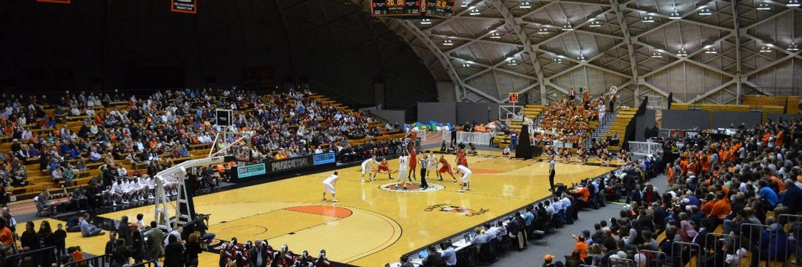

I am currently Director of Pricing Strategy at [Mojo](https://www.mojo.com/), where I develop and deploy models to predict athletes' career performance and manage risk. 

I have extensive experience in sportswriting and statistical analysis. You can see [a few recent blog posts on sports here](/tag/sports/) and some of my favorite writing below.

#### MIT Sloan Sports Analytics Conference (2013)

My research paper, "Does a 'coattail effect' influence the valuation of players in the Major League Baseball draft?", was accepted for publication and a poster at the 2013 MIT Sloan Sports Analytics Conference. [You can read the paper here](./Kevin_Whitaker_SSAC_2013.pdf).

#### Risk Preferences and Wage Determination in MLB (2013)

My Princeton senior thesis, "Risk Preferences and Wage Determination in the Major League Baseball Labor Market," empirically studied the impact of volatility on players' salaries in free agency. Using a sample of 1,599 contracts signed from 1993-2012, MLB teams were found to pay a premium for players with more volatility, indicating that they are risk-seeking, but only for short-term contracts. [You can read the paper here](./THESIS-FINAL.pdf).

#### Princeton Alumni Weekly (2010-23)

I was a student contributor to PAW from 2011-13 writing weekly columns and regular magazine features on Princeton sports, and since then I have occasionally contributed articles on Princeton football and basketball. You can find [my author archive here](https://paw.princeton.edu/search/site/%2522By%2520Kevin%2520Whitaker%2520%25E2%2580%259913%2522) and some favorite articles below: 
- [Still Evolving, Ivy Tournament Comes to Jadwin for the First Time](https://paw.princeton.edu/article/still-evolving-ivy-tournament-comes-jadwin-first-time)
- [Dartmouth topples Princeton in unbeaten battle at Yankee Stadium](https://paw.princeton.edu/article/football-dartmouth-topples-princeton-unbeaten-battle-yankee-stadium)
- [Dancing again](https://paw.princeton.edu/article/womens-basketball-dancing-again)
- [Don't fear the Ivy League Tournament](https://paw.princeton.edu/article/don%E2%80%99t-fear-ivy-league-tournament)
- [The comeback: Princeton football stuns Harvard, 39-34](https://paw.princeton.edu/article/comeback-princeton-football-stuns-harvard-39-34)

#### NYC Buckets (2014-18)

I wrote a weekly column about Ivy League Basketball, covered games from various mid-major conferences, and wrote occasional analysis features for NYC Buckets, a website covering college basketball around the Northeast. The website has since disbanded but some of my favorite evergreen articles are saved here: 
- [You can take the players out of New York City, But…](https://medium.com/chart-shots/you-can-take-the-players-out-of-new-york-city-but-fb2386050d75)
- [The long arc of home-court advantage](https://medium.com/chart-shots/the-long-arc-of-home-court-advantage-dc54c591bb7f)
- [The Shotties: Detailed shot charts](https://medium.com/chart-shots/the-shotties-miscellaneous-ivy-league-awards-406a3deca259)
- [Evaluating preseason college basketball projections](https://medium.com/chart-shots/evaluating-preseason-college-basketball-projections-eccbb34345fd)
- [How scorekeeper biases affect shot-selection data](https://medium.com/chart-shots/how-scorekeeper-biases-affect-shot-selection-data-987915423538)

#### Baseball Prospectus (2013-14)

I wrote two guest articles for Baseball Prospectus: 
- [Riding top prospects’ coattails in the MLB Draft](https://www.baseballprospectus.com/prospects/article/23795/baseball-proguestus-riding-top-prospects-coattails-in-the-mlb-draft/)
- [Rethinking Hall of Fame standards in expansion eras](https://www.baseballprospectus.com/news/article/22497/baseball-proguestus-rethinking-hall-of-fame-standards-in-expansion-eras/)

#### The Daily Princetonian (2009-13)

I was the Executive Editor for Sports for two years, in which I managed a staff of about 20 writers, created and assigned story ideas, coordinated with other sections, and wrote articles and columns. I also worked as a columnist, senior writer, and staff photographer for the sports section before and after my time as editor. 

#### Sports Illustrated (2012)

I was an editorial intern at Sports Illustrated in 2012, doing research and fact-checking for magazine articles and writing for a special issue on college football. 