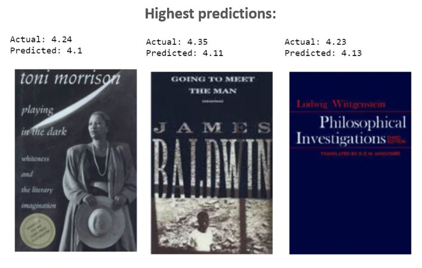
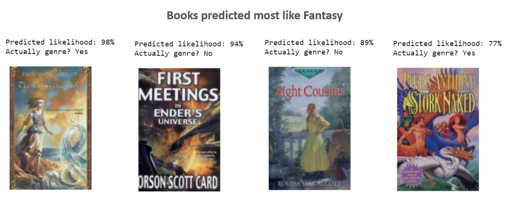
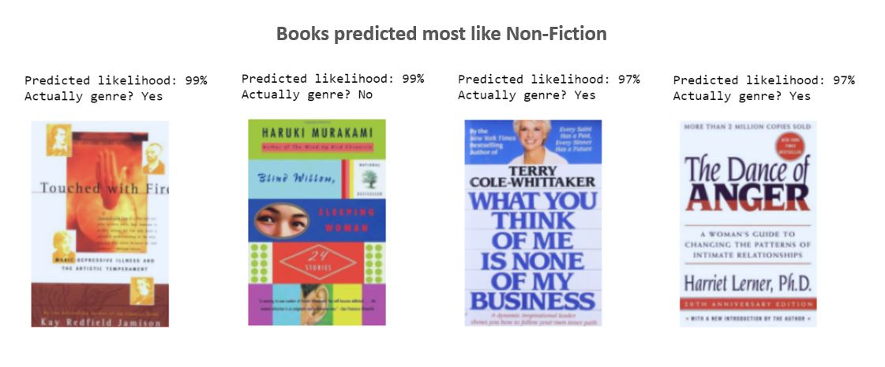

You know the adage: you can't judge a book by its cover. But let's be real, I do it all the time, and you probably do too. You can think of books that confirm or disprove the old saying, but advancements in AI, image recognition algorithms, and crowdsourcing platforms allow us to go beyond anecdotes and analyze this in more detail: can you judge a book by its cover after all?

As recently as a decade ago, most applications of image recognition were nearly impossible. But [a 2012 breakthrough](https://www.technologyreview.com/2014/09/09/171446/the-revolutionary-technique-that-quietly-changed-machine-vision-forever/) showed that neural networks (now the dominant algorithm used in AI) could recognize images really effectively. Since then, improvements in hardware have made image recognition much more powerful -- Google Photos has used it for years to tag faces automatically, and self-driving cars are becoming more than a dream -- and software has kept pace to make it much easier to use. Instead of needing PhD in computer science to implement such techniques, now anyone with a bit of coding background can [take a course online](https://course.fast.ai/) and create [a toy image classification widget](https://mybinder.org/v2/gh/whitakk/fastai_2020/master?urlpath=%2Fvoila%2Frender%2Fnbs%2F02_bear_in_production.ipynb) in about three days, and do something new -- like attempt to judge books by their covers -- with another week or two of tinkering. (For those of you interested in this sort of thing, the code underpinning the rest of this piece is [here](https://github.com/whitakk/book_covers/blob/master/book_covers_analysis.ipynb).)

To test the adage, I used GoodReads book reviews as a measure of quality. Picking a useful sample is actually fairly tricky -- if you just pick books completely randomly, the vast majority are never reviewed (there are a *ton* of obscure books out there), but if you choose from most-popular lists you'll be biased toward the best books. I split the difference by finding this list of 10,000 notable books with GoodReads links and ratings, and from there took a random sample of 1,000 of those and downloaded their covers.

After training an image recognition algorithm (a version of [ResNet](https://en.wikipedia.org/wiki/Residual_neural_network)) on 800 of the books, then trying to predict the remaining 200 with that model, these are the results: 

...which are not so great. There's no real visible correlation -- basically our model predicts every book will get a rating of about 4.0, with very little variation (except one random outlier it doesn't like).

Is there *anything *useful here? Regression models can be measured by the average squared error, which is .085 here (indicating that the average prediction is off by roughly the square root of .085, or .29 stars). That sounds okay ... until we test an alternative method of "just predict the average rating (just under 4.0) every time", which has an even better squared error of .081! In other words, our model is worthless.

An inspection of the most extreme predictions in our model doesn't yield any obvious insights either:

So it seems like the adage is true: you can't judge a book by its cover! Of course, maybe someone with more than like a dozen hours' experience of image recognition would do better. But it makes sense that there's no way to predict a book's rating from its cover alone. Think of it as an efficient-markets theory -- authors and publishers put a lot of time and resources into making their covers as attractive as possible. If there was anything on the cover of some books that predictably signaled they were better, then everyone would want to buy those books -- so all the other authors and publishers would copy them, and the signal would be lost. (This only applies to relatively high-profile books -- if you included all independent books without any marketing resources, there might be a different story.)

**A matter of taste**

But *overall quality* is not the only way to judge a book. Even if the cover doesn't tell you how "good" or "bad" a book is, it might tell you what *kind *of book it is -- look no further than the recent spate of [political tell-alls that all looked the same](https://slate.com/culture/2020/08/trump-political-book-covers-trend-sith-lord-palette.html). And different people like different kinds of books. So even if you can't judge if a book is objectively good or bad from its cover, maybe you can judge if it's right *for you*?

To understand if we can infer the type of book from its cover, I pulled the most common "tags" for each book from GoodReads' API, filtered for the 20 most popular genres (to eliminate the long tail of rare genres), and trained a new model to predict genres from the cover. (Books could be assigned to more than one genre, e.g. "fiction" and "fantasy", or "non-fiction" and "biography", and all genres are just based on user classifications so they are not perfectly consistent.)

The results here were more encouraging: When the model predicted that a book would be a certain genre, it was right 42% of the time; and overall it identified 34% of correct genre assignments. In both cases, a baseline of average guessing (calibrated to the relative prevalence of each genre) would have gotten only 28% right. So our model isn't great, but it's better than chance alone -- so there's something in the covers of at least some books that reliably indicates what kind of books they are. ([An earlier research paper](https://www.technologyreview.com/2016/11/07/69700/deep-neural-network-learns-to-judge-books-by-their-covers/#:~:text=A%20machine%2Dvision%20algorithm%20can,to%20design%20the%20covers%20themselves.&text=The%20idiom%20%E2%80%9Cnever%20judge%20a,by%20the%20way%20it%20looks.) showed the same.) 

What information on the cover is our model picking up? Here's one example: it has clearly learned that the "Penguin Classics" style indicates books in the "Classics" genre.

And "Fantasy" books seem to have colorful covers with a blend of hues. (The accuracy here isn't great, but you can give it partial credit for #2 if you think of science fiction and fantasy as being adjacent genres.)

And our model is likely a bit more accurate than the statistics indicate, because some books are not exhaustively labeled. For instance, #1 under "Fiction" here is indeed a fiction book, but it hasn't been tagged as such on GoodReads (instead tagged as just Mystery and Historical Fiction). If we corrected those errors, we could train the model better and it would also likely score better in evaluation.

Try it for yourself [by following this link and uploading a picture](https://mybinder.org/v2/gh/whitakk/book_covers/master?urlpath=voila%2Frender%2Fbook_genre_predictor.ipynb) -- it will tell you what genres the model predicts for this book. (Note that it takes a little while to load, and may take a couple seconds from when you upload your picture to show results.)

Of course, it isn't very useful to predict a book's genre from the cover, because you usually know that when you're considering buying it. But it demonstrates that there is information encoded in the cover about what type of book it is, which might apply to dimensions beyond just genre.

And it makes sense that this could work. As mentioned before, if there was something that signaled "this is a great book" it would be adopted everywhere -- but something that signals "this is a great book *for you,* *if you like books of a certain type*" can't be adopted everywhere, because it will turn off people who prefer a different type instead. So signaling this way is actually effective.