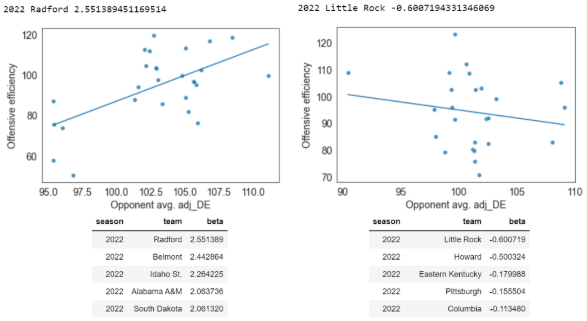
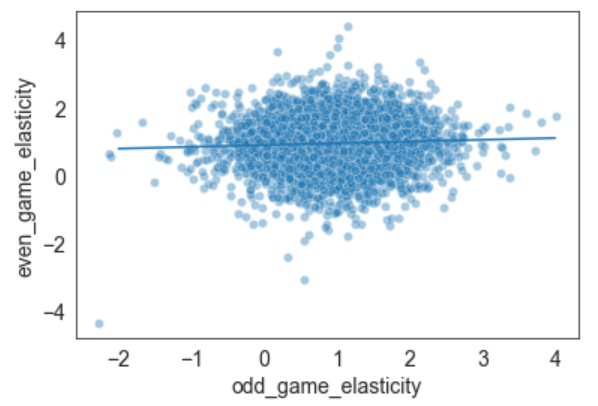

Does "opponent elasticity" matter in college basketball?
---------------------------

Around the start of this year's NCAA tournament, I started wondering: do different offenses have different "opponent elasticities"? What I mean by opponent elasticity is how much worse an offense gets when they play a better defense. In particular, I suspected that a team that always takes lots of difficult shots (like UCLA, which attempted more long two-pointers than any other tournament teams and made a lot of them) might do almost as well against good defenses as against bad ones, because there's no real way for anyone to stop them from taking tough shots. In contrast, teams that pass the ball well to get easy shots might be even better against bad opponents but struggle more against good ones that are disciplined and athletic enough to take away easy shots.

[Betterige's Law](https://en.wikipedia.org/wiki/Betteridge%27s_law_of_headlines) holds here: although there are some non-random differences in "opponent elasticities", they're so small that they have basically no practical value, and they don't strongly correlate with any measures of offensive style.

But if you're still interested in reading further...

[Bart Torvik's T-Rank ratings site](https://barttorvik.com/#) has game-by-game offensive and defensive efficiency data for all Division I games going back to 2008, as well as adjusted offensive and defensive efficiency for each game. That allowed me to calculate two metrics for each team in each game:

-   Raw offensive efficiency (points scored per 100 possessions), adjusted for home-court advantage
-   Average adjusted defensive efficiency *in every other game that season* (points allowed per 100 possessions, controlling for opponent strength, but removing the impact of the game in question)

*(If you ever want to use Torvik's raw data for analysis, see his post here for [easy download links](http://adamcwisports.blogspot.com/p/data.html) that don't involve messy and unkind web-scraping.)*

Using this data, I calculated each team's "opponent elasticity" over the course of each season by finding the slope of the regression line for offensive efficiency against opponent other-game defensive efficiency. This slope represents how much a team's offensive efficiency increased/decreased when playing better/worse defenses.

The median team has an opponent elasticity of about 1.0 -- for every point worse the opponent's adjusted defensive efficiency is, your team's offense is expected to be one point more efficient against them. (If that wasn't the case, something would be wrong, because that's exactly how adjusted efficiency is defined!) However, there's a wide variation of elasticities between teams: 15% had elasticities below 0.5, and 2% even had negative elasticities -- they were *more* efficient, on average, against better defenses.

Here are the most extreme opponent elasticities in 2022:

But college basketball seasons are short, and this metric is noisy: in the Little Rock example above, you can see the negative elasticity is mostly driven by a single game, when they had one of the most efficient performances of the season against Arkansas, by far the best defense they played. Is there true variation between teams in their opponent elasticities, or is what we observe here just noise?

One way to assess this is [split-half reliability](https://statspeakmvn.wordpress.com/2008/01/06/on-the-reliability-of-pitching-stats/) -- if we split each team's season into two half-seasons, one with odd-numbered games and one with evens, are the two halves correlated? (Odds vs evens is better here than first-half vs second-half because most teams' strength of schedule is much different in conference play compared to non-conference play.) When we measure the elasticity in each half and compare, the results are ... underwhelming:

It's hard to see at this scale, but there is a small correlation (r=.05), and with more than 5,000 team-seasons in our sample, we can actually find small effects. A [fake-data simulation](https://statmodeling.stat.columbia.edu/2019/03/23/yes-i-really-really-really-like-fake-data-simulation-and-i-cant-stop-talking-about-it/) helps us see if this is a real small effect or just noise. An easy way to do that here is to shuffle all of the observed half-season-betas across teams, divide them randomly into two "first-half" and "second-half" lists, and measure the correlation between them; the average correlation will of course be zero, but if this often gives us correlations stronger than .05, what we saw was probably noise. However, 1000 such simulations never give us a correlation quite as strong as the one we've observed, so it seems there is some real, albeit small, persistence in a team's elasticity between halves.

How small, though? The value of opponent elasticity is that, by knowing that some offenses are more or less elastic, we might be able to make better predictions about the next game than the generic adjusted efficiency numbers would tell us. Given our findings, could we make any use of this factor?

-   The regression line above has a slope of .05, which means that if a team has zero elasticity halfway through the season (efficiency completely uncorrelated with opponent), the best estimate of their elasticity in the second half of the season is .95, instead of the 1.0 you'd expect for the average team.
-   The best defenses are usually about 15 points per 100 possessions better than average, so if you're about to face the best defense in basketball, applying the lower elasticity increases projected offensive efficiency by 15*.05 = .75 points per 100 possessions.
-   College games are usually about 65-70 possessions, so that rounds to about 0.5 points per game.

0.5 points per game isn't meaningless in forecasting, but it's getting pretty close, and that's for one of the most extreme cases -- in most games the impact would probably be less than a tenth of a point. So although the differences in opponent elasticity between offenses may be statistically significant, they're practically insignificant.

And, back to the original hypothesis, no single stylistic factor has a high correlation with opponent elasticity. The only factor that's strongly correlated with opponent elasticity is how good your offense is overall (adjusted offensive efficiency) -- better offenses have lower elasticities -- although even here the effect is small (the best/worst offenses have average elasticities of about .95/1.05). If you squint at the other factors, it kind of seems like teams that take more shots at the rim have higher elasticities, but it's not very reliable, and the impact would be even smaller. For teams that take lots of long twos, they don't seem to be any more or less elastic than anyone else.

[See code here](https://github.com/whitakk/cbb_efficiency_profile/blob/main/notebooks/analysis.ipynb)